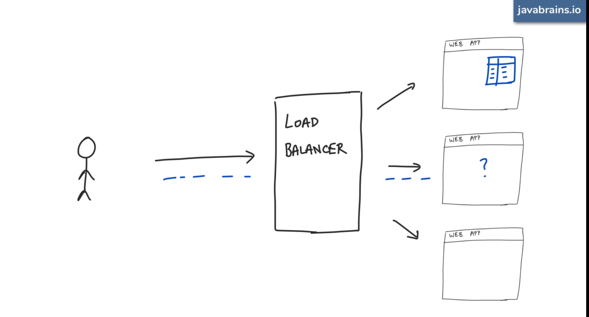
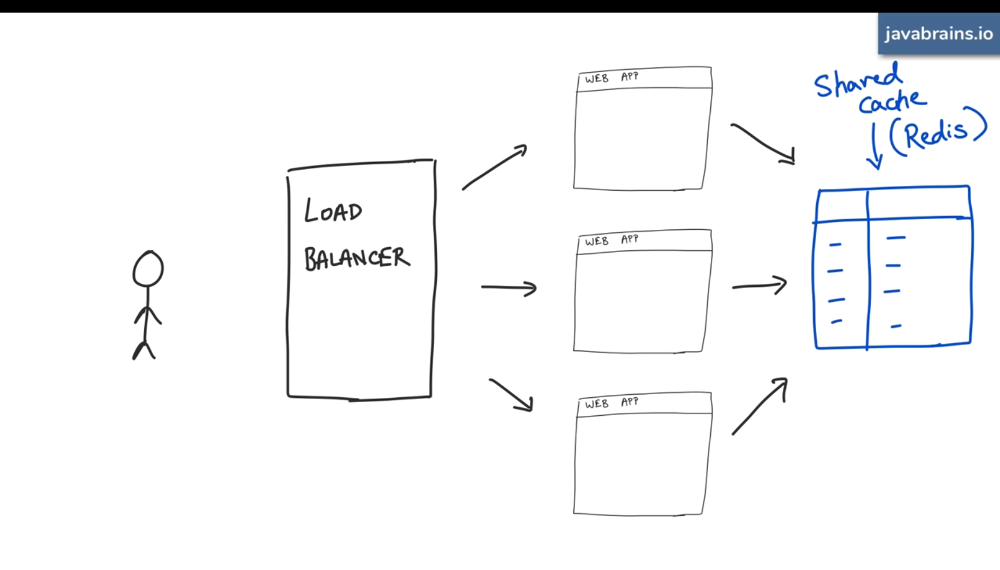
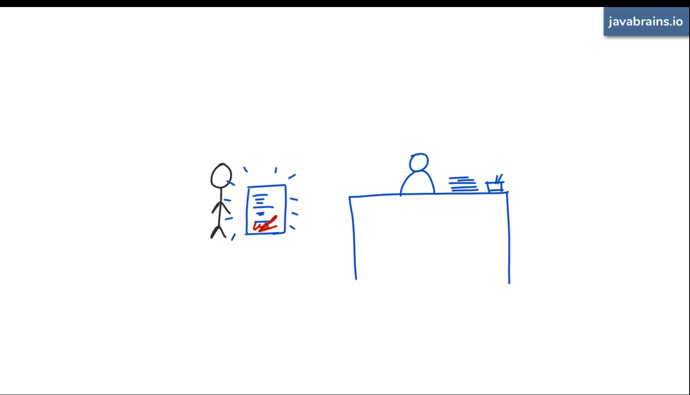
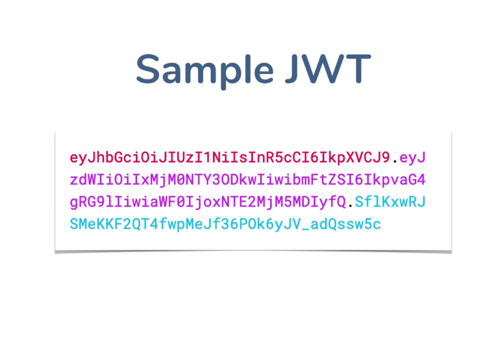
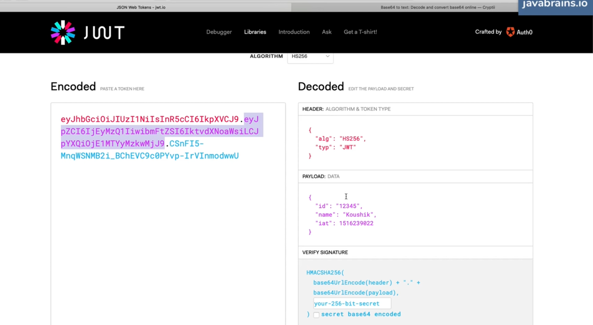
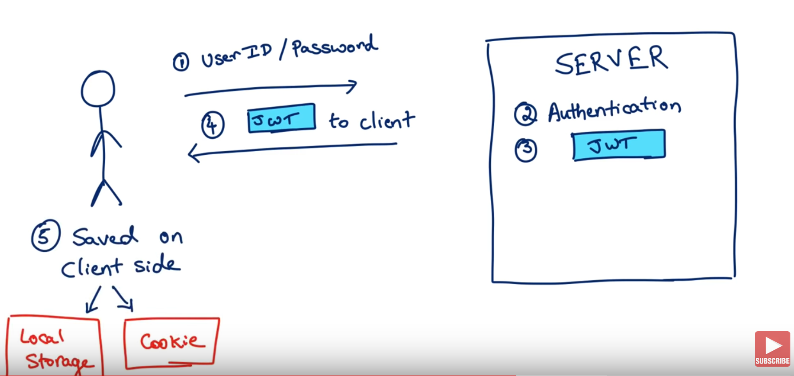
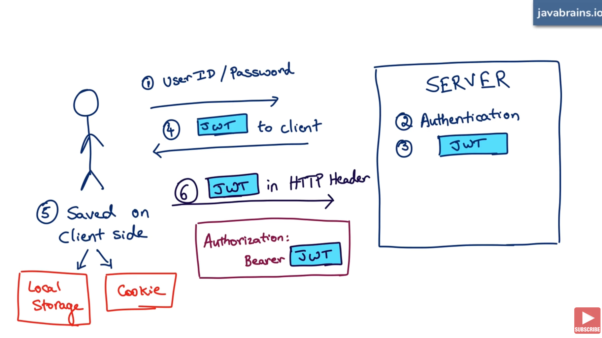
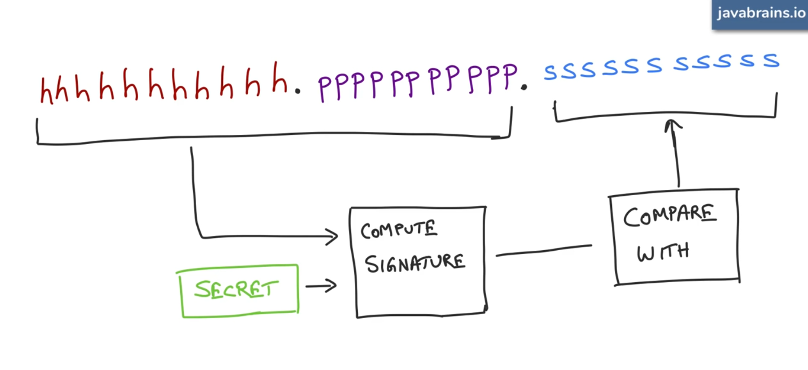

# J(A)WT

### JSON Authorization Web Token

Reference:

[What is JWT authorization really about - Java Brains](https://www.youtube.com/watch?v=soGRyl9ztjI)

[What is the structure of a JWT - Java Brains](https://www.youtube.com/watch?v=_XbXkVdoG_0)

### Authorization Strategies

1. Session token
2. JSON web token

### HTTP Protocol and need for Authorization tokens

- HTTP is a stateless protocol.
- Every thing that is required for interaction needs to be communicated with every request.
- Each request is self contained

Session token

1. Server creates a session and assigns an id and gives that out to client in a cookie.

Most popular mechanism for authorization

Assumes one monolithic web server is present

2. Modern web apps have multiple servers. 

A load balance sits in front that routes the traffic to multiple servers

What is shared cache that stores session id goes down ?

In this approach, server should remember the id and user

### JWT

Server returns user information itself when user is ***authenticated with the server and this information  contains a signature***

This way server need not remember user information

With every request, User has to hand out this information to the server that the server gave it in the first place

### How does a JWT look like ?

Well, it definitely does not look like a JSON object

Observer the three periods/three colors in the string (base64 encoded string)

> **Structure of JWT**

**Token with JSON value**

1. Header - Tells how it is being signed (algorithm, type whether JWT)
2. Payload - Contains Content information (user id, name, created at , etc)
3. Signature - Server that issues can only calculate this. It is computed for the original value of payload + Header. If client modifies this, signature becomes invalid.

[JWT.IO](https://jwt.io)

You can play with JWT in the above link.

Steps:

### Trivia:

- Do not include any sensitive information in your JWT token
- What if someone steals my JWT token ? - It has to be server over HTTPS, Use OAuth so that people do not steal JWTs
- Blacklisted JWTs. If users complain about JWT being stolen
