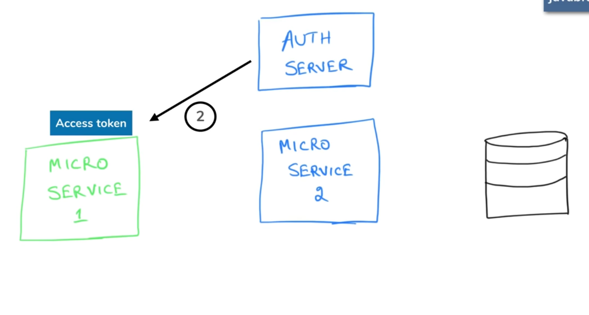

### Reference

[What is OAuth really all about - OAuth tutorial - Java Brains](https://www.youtube.com/watch?v=t4-416mg6iU)

[OAuth terminologies and flows explained - OAuth tutorial - Java Brains](https://www.youtube.com/watch?v=3pZ3Nh8tgTE)

### Why OAuth ?

Authentication or Authorization ?

OAuth is meant for Authorization

However, it is not a mechanism for authorization between a user and a server

It is a mechanism for Authorization between two applications/services

E.g: Photo Printing website

Nobody keeps photos on their machines anymore. They store it in cloud

What if users send the google photos link

You cannot ask users to handout their google id and password ;)

### OAuth2.0

Valet key example

You own a car. You don't handout main key to the Valet. You give Valet key with limited functionality to the Valet (Car compartments, Trunk cannot be opened with this key)

Treat Car and Valet as two different services for Car owner

## The OAuth Flow:

### OAuth Access Token

- Contains user allowed permissions
- Trustable (Cannot be Tampered)
- Format of token can be JWT

### Terminologies

1. Resource (Protected)
2. Resource Owner - (🙎🏻‍♂️)
3. Resource Server (Server hosting the protected resource) (E.g., Google Drive)
4. Client - Application making requests to protected resource on behalf of Resource owner
5. Authorization Server - Coupled with Resource server 

### OAuth Flows step by step

- Authorization Code Flow
1. User has logged into Photo server
2. User says the photo server (client) to go access the resource in resource server
3. Photo printing server goes and talks to Authorization server
4. Authorization server goes to resource owner and asks if he is okay with the Client accessing it
5. Resource owner authorizes
6. Authorization server sends the client an authorization token
7. Client sends this authorization token to auth server back and authorization server sends back Access token
8. Client calls to Resource server with the access token asking for the resource
9. Resource server hands out the resource to the Client
- Implicit flow

Very similar to flow number 1. But simplified

1. Steps 1,2,3,4,5 are same
2. Authorization server sends the access token directly back to the client instead of authorization token
3. Not as secure as first flow.
Used with JavaScript apps or short lived access tokens

## Authorization between Microservices

## Client Credentials flow:

Let's say MS1 calls MS2 API which leverages data in DB

MS1 first calls Auth server and says I am MS1

Auth server sends Access token with right privileges information

MS1 then calls MS2 API with the access token

### Trivia:

OAuth can be called for Authentication also

E.g., Signin with google, Sign in with Facebook